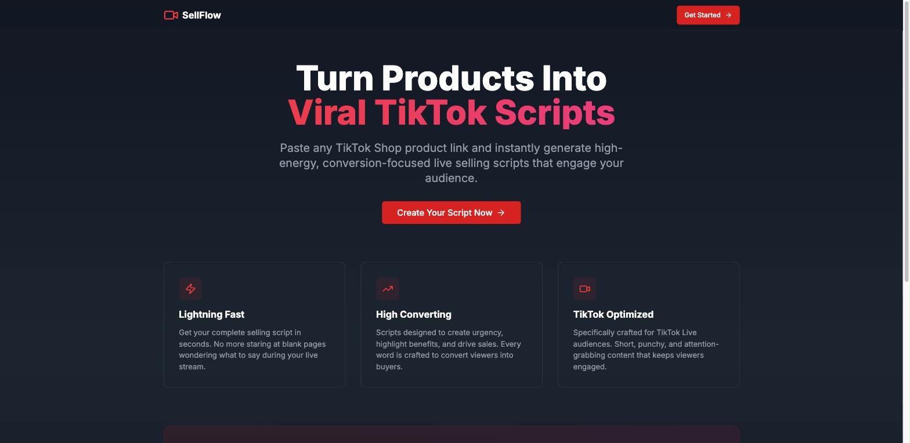
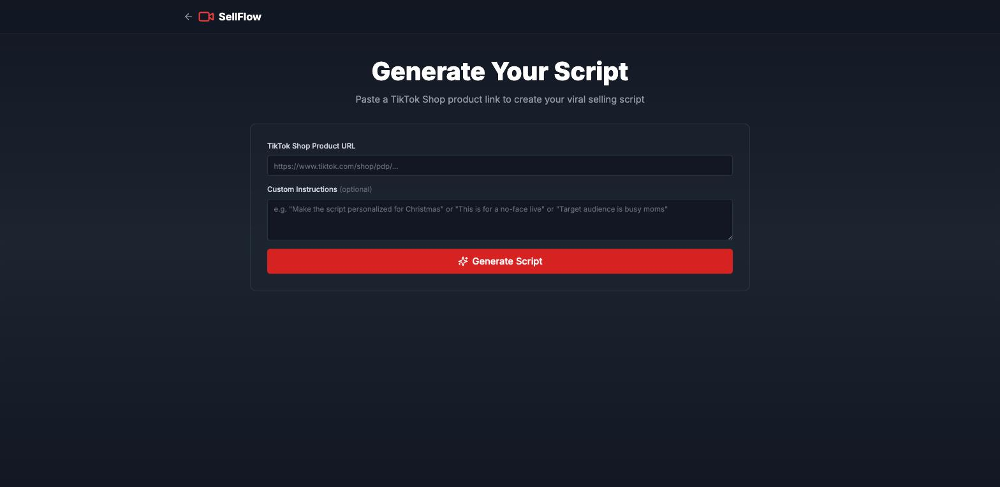

# SellFlow

Paste a TikTok Shop product link, get a full livestream selling script — streamed back word
by word as the model writes it.

[](https://bolt.new/~/sb1-ebe8ihw8)



## The problem

TikTok Shop live sellers have to talk continuously for one to two hours per stream, and dead air
loses the room. Most sellers either wing it or write a script that runs out after fifteen minutes.
SellFlow takes the product link they're already selling from, pulls the real product data behind
it, and writes a loopable script built around the patterns that actually convert on live —
urgency, scarcity, social proof, price anchoring, and explicit calls to action.

Because the script is grounded in scraped data rather than generic filler, the host gets lines
they can say verbatim: *"only 13 left in stock"*, *"$15 instead of $35"*, *"they've already sold
over 500,000 of these"*.

## How it works

```
Paste TikTok Shop URL
        │
        ▼
┌────────────────────────┐
│  scrape-product        │   Deno edge function
│  → ScrapeCreators API  │   normalizes the raw payload into a typed Product
└────────────┬───────────┘   (title, price, discount, seller, rating, sold
             │                count, stock, variants, images, tags)
             ▼
   Product card renders immediately
             │
             ▼
┌────────────────────────┐
│  generate-script       │   Deno edge function
│  → Anthropic Messages  │   streams; the response body is piped straight
│    API (SSE)           │   through as text/event-stream — never buffered
└────────────┬───────────┘
             ▼
   Script streams into the UI, word by word
```

**The part worth explaining in an interview** is the streaming. A 20,000-token script takes
roughly 30 seconds to generate. The first version waited for the whole response, which blew past
the edge function's connection timeout and surfaced to the user as `Failed to fetch`. The fix was
to stop treating the generation as a request/response at all:

```ts
// supabase/functions/generate-script/index.ts
return new Response(claudeResponse.body, {
  headers: { ...corsHeaders, "Content-Type": "text/event-stream" },
});
```

The edge function passes Anthropic's stream through untouched, so bytes start moving immediately
and the connection never idles. The client reads it with a `ReadableStream` reader and appends
each decoded chunk to React state, which turns a 30-second blank spinner into a sub-second
time-to-first-token and a script the user can start reading while it's still being written.

Auto-scroll follows the text but yields to the reader: if you scroll up mid-generation it stops
chasing the bottom, and resumes once you're back within 80px of it.



## Stack

| Layer | What |
| --- | --- |
| Framework | Next.js 13.5 (App Router), React 18, TypeScript 5.2 |
| Styling | Tailwind CSS 3.3, CSS-variable dark theme |
| Components | shadcn/ui (Radix primitives), lucide-react icons, Sonner toasts |
| API | Two Supabase Edge Functions (Deno, TypeScript) |
| AI | Anthropic Claude (`claude-sonnet-4-6`), streaming, adaptive thinking |
| Scraping | ScrapeCreators API |
| Hosting | Netlify (`@netlify/plugin-nextjs`) |

There is no Node or Python server — the two edge functions are the entire backend. They exist so
that `CLAUDE_API_KEY` and `SCRAPE_CREATORS_API_KEY` stay server-side; the browser only ever holds
the Supabase anon key.

## Routes

| Route | What it is |
| --- | --- |
| `/` | Landing page — hero, feature cards, how-it-works |
| `/app` | The tool: paste a URL, add optional instructions, watch the script stream in |

## Running it locally

```bash
npm install
cp .env.example .env.local   # then fill in your own values
npm run dev
```

Open http://localhost:3000.

The landing page and the `/app` UI render without any configuration. Generating a script needs
all four variables below — the two `NEXT_PUBLIC_*` ones in `.env.local`, and the two secrets set
on the deployed edge functions (never in the client bundle).

| Variable | Where it lives | Purpose |
| --- | --- | --- |
| `NEXT_PUBLIC_SUPABASE_URL` | `.env.local` | Edge function base URL |
| `NEXT_PUBLIC_SUPABASE_ANON_KEY` | `.env.local` | Calls the edge functions |
| `CLAUDE_API_KEY` | Edge function secret | Anthropic API auth |
| `SCRAPE_CREATORS_API_KEY` | Edge function secret | Scraping API auth |

Deploying the functions:

```bash
supabase functions deploy scrape-product
supabase functions deploy generate-script
supabase secrets set CLAUDE_API_KEY=... SCRAPE_CREATORS_API_KEY=...
```

## Layout

```
app/
  page.tsx            Landing page
  app/page.tsx        The tool — scrape → stream → copy/download
  layout.tsx          Root layout, Inter font, Sonner mount
components/ui/        shadcn/ui primitives (Radix-based)
hooks/use-toast.ts
lib/utils.ts          cn() class merger
supabase/functions/
  scrape-product/     ScrapeCreators call + payload normalization + retries
  generate-script/    System prompt + Anthropic streaming pass-through
```

The prompt engineering lives in `supabase/functions/generate-script/index.ts`. The system prompt
requires nine elements in every script (CTA, urgency, scarcity, social proof, price anchoring,
deal instructions, force CTR, problem-solution, audience callout), each with worked examples, and
asks for timed segments with loop markers so the host can restart cleanly on a two-hour stream.

## Known limits

- `scrape-product` is built against TikTok Shop's payload shape via ScrapeCreators; other
  storefronts aren't supported.
- Scrape failures retry 3 times with a linear backoff (1s, then 2s) and only on HTTP 500 or a
  thrown network error — a 404 fails immediately.
- Nothing is persisted. Generated scripts live in React state until you copy or download them;
  there is no history, no accounts, and no database tables.
- ESLint is skipped during builds (`next.config.js`) and Next.js image optimization is off.
